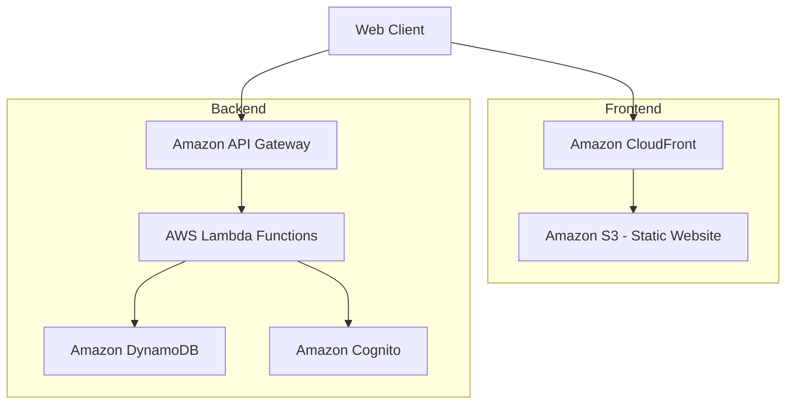

# Design Document: Restaurant Tracker

## Overview

The Restaurant Tracker is a serverless application that allows users to track restaurants they want to visit or have visited, along with reviews and ratings. The application will be built using AWS serverless technologies to ensure scalability, cost-effectiveness, and minimal maintenance requirements.

This design document outlines the technical approach, architecture, data models, and component structure for implementing the Restaurant Tracker application based on the requirements.

## Architecture

The application will follow a serverless architecture pattern using AWS services:



### Key Components:

1. **Frontend**:

   - Single Page Application (SPA) built with React
   - Hosted on Amazon S3 and distributed via CloudFront
   - Responsive design for mobile and desktop use

2. **Authentication**:

   - Amazon Cognito for passwordless email authentication
   - JWT tokens for maintaining user sessions

3. **API Layer**:

   - Amazon API Gateway for RESTful API endpoints
   - API Gateway authorization using Cognito User Pools

4. **Business Logic**:

   - AWS Lambda functions for handling business logic
   - Separate functions for different domains (auth, restaurants, reviews)

5. **Data Storage**:

   - Amazon DynamoDB for NoSQL data storage
   - Optimized access patterns for user-restaurant relationships

6. **Infrastructure**:
   - AWS CDK for infrastructure as code
   - CI/CD pipeline for automated deployments

## Components and Interfaces

### Frontend Components

1. **Authentication Components**:

   - Login/Signup Form
   - Authentication State Management
   - Protected Route Wrapper

2. **Restaurant List Components**:

   - Restaurant List View
   - Search and Filter Controls
   - Add Restaurant Button/Form
   - Pagination Controls

3. **Restaurant Detail Components**:
   - Restaurant Information Display
   - Edit Restaurant Form
   - Visit Status Toggle
   - Review Form
   - Review List

### Backend API Endpoints

1. **Authentication Endpoints**:

   - `POST /auth/login` - Initiate login process
   - `POST /auth/verify` - Verify magic link

2. **Restaurant Endpoints**:

   - `GET /restaurants` - List user's restaurants with filtering
   - `POST /restaurants` - Create new restaurant
   - `GET /restaurants/{id}` - Get restaurant details
   - `PUT /restaurants/{id}` - Update restaurant details
   - `DELETE /restaurants/{id}` - Delete restaurant

3. **Review Endpoints**:
   - `POST /restaurants/{id}/reviews` - Add review note
   - `PUT /restaurants/{id}/rating` - Set/update star rating
   - `GET /restaurants/{id}/reviews` - Get all reviews for a restaurant

## Data Models

### User Model

```json
{
  "userId": "string", // Cognito user ID
  "email": "string",
  "createdAt": "timestamp",
  "updatedAt": "timestamp"
}
```

### Restaurant Model

```json
{
  "restaurantId": "string", // UUID
  "userId": "string", // Owner's user ID
  "name": "string", // Required
  "location": "string", // Optional
  "cuisineType": "string", // Optional, from predefined list
  "description": "string", // Optional
  "visited": "boolean", // Default: false
  "rating": "number", // 0-5, null if not rated
  "createdAt": "timestamp",
  "updatedAt": "timestamp"
}
```

### Review Note Model

```json
{
  "reviewId": "string", // UUID
  "restaurantId": "string", // Reference to restaurant
  "userId": "string", // Owner's user ID
  "text": "string", // Review content
  "createdAt": "timestamp"
}
```

### DynamoDB Schema Design

We'll use a single-table design pattern for DynamoDB with the following access patterns:

1. Get all restaurants for a user
2. Get a specific restaurant by ID
3. Get all review notes for a restaurant
4. Update restaurant details
5. Update restaurant rating

Primary key structure:

- Partition Key: `PK` (e.g., "USER#123", "RESTAURANT#456")
- Sort Key: `SK` (e.g., "METADATA", "REVIEW#789")

GSI1 for querying restaurants by cuisine type:

- Partition Key: `userId`
- Sort Key: `cuisineType`

GSI2 for querying restaurants by visited status:

- Partition Key: `userId`
- Sort Key: `visited`

## Error Handling

1. **Client-Side Error Handling**:

   - Form validation errors with clear user feedback
   - Network error handling with retry mechanisms
   - Authentication error handling with redirect to login

2. **API Error Handling**:

   - Standardized error response format
   - HTTP status codes for different error types
   - Detailed error messages for debugging (in development)
   - Generic error messages for production

3. **Lambda Error Handling**:
   - Try/catch blocks for all database operations
   - Error logging to CloudWatch
   - Custom error classes for different error types

## Testing Strategy

1. **Unit Testing**:

   - Jest for JavaScript/TypeScript unit tests
   - Test coverage for all Lambda functions
   - Mock DynamoDB for data access tests

2. **Integration Testing**:

   - API Gateway test events
   - End-to-end testing of authentication flow
   - DynamoDB local for integration tests

3. **Frontend Testing**:

   - React Testing Library for component tests
   - Mock API responses for UI testing
   - Cypress for end-to-end testing

4. **Manual Testing Checklist**:
   - Authentication flow
   - Restaurant CRUD operations
   - Review functionality
   - Filter and search functionality
   - Responsive design testing

## Security Considerations

1. **Authentication**:

   - Secure JWT handling
   - Token expiration and refresh strategy
   - Protection against common authentication attacks

2. **Authorization**:

   - Resource-based access control
   - Validation that users can only access their own data

3. **Data Protection**:

   - Input validation on all API endpoints
   - Protection against injection attacks
   - HTTPS for all communications

4. **AWS Security**:
   - Least privilege IAM roles
   - Resource policies for S3 and DynamoDB
   - API Gateway throttling to prevent DoS attacks

## Deployment Strategy

1. **Infrastructure as Code**:

   - AWS CDK for defining all infrastructure
   - Environment-specific configurations

2. **CI/CD Pipeline**:

   - GitHub Actions for automated testing and deployment
   - Separate development and production environments
   - Automated testing before deployment

3. **Monitoring and Logging**:
   - CloudWatch Logs for Lambda functions
   - CloudWatch Metrics for API Gateway
   - Alarm configuration for error rates and latency
